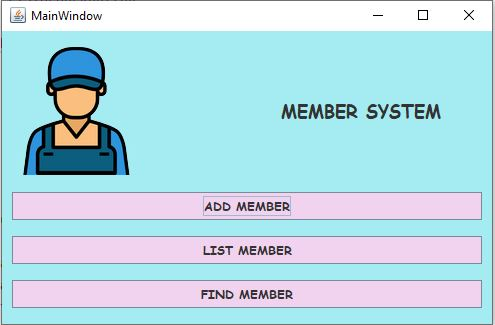

# FirstProjectMYLIFE_borntoDevschool
Basic Java Programming and MySQL Basics
This is my first project in Java programming. I have utilized JFrame for the user interface and connected it with MySQL for database integration.

